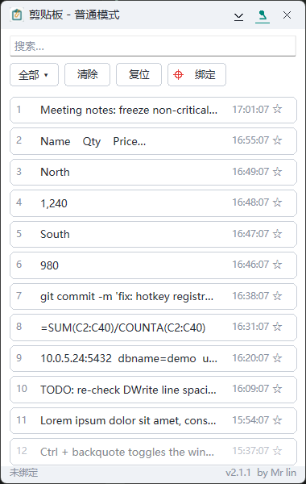
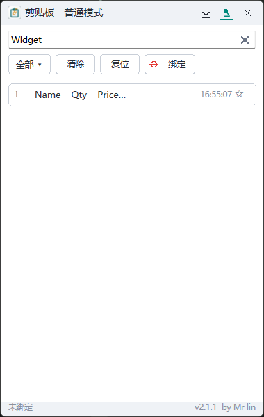
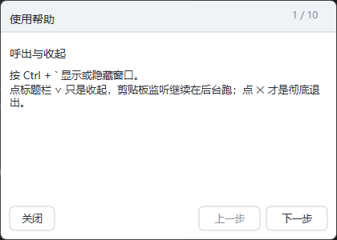
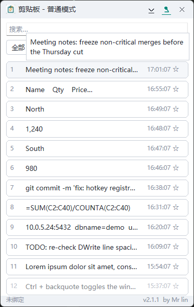

# SuperClip

> **SuperClip** · C++20 + 纯 Win32 + Direct2D 全自绘 · 单机剪贴板历史管理器
>
> 复制过的内容它替你留着：一个全局热键呼出列表，选中即粘回你要的地方。不联网、不装运行库、数据只在你自己的机器上。

版本 [v2.4.2](CHANGELOG.md) · 交付 单文件 exe · 网络 [零（需求红线 AC-8）](doc/DESIGN.md) · 授权 见[许可证](#许可证)

**平台**：Windows 10 / 11（x64）**已实机走查**。Windows 7 SP1 – 8.1 是代码层面的设计下限
（`_WIN32_WINNT = 0x0601`、所有 Win8+ API 都动态探测并带回退），**但从未在真机上跑过**，见
[已知限制](#已知限制)。

[English](#english) | [中文](#这是什么)

---

## 这是什么

- **复制过的东西还能再粘**。系统剪贴板只存最后一条，SuperClip 把最近的都留着（上限 500 条），随时翻出来重新粘。
- **不用切换窗口**。`Ctrl` + `` ` `` 在任何应用里呼出列表，选中就粘回你刚才的光标位置，用完自动收起。
- **能从 Excel/WPS 一次粘一格**。复制一片区域，它按单元格拆成一条条，逐格粘贴，不用再手动切。
- **填表能接力**。快速模式下按住 `Alt` 点哪个输入框，就把列表第一行贴进那个框，贴过的自动沉底、下一条上位。
- **常用的那几条可以收藏**。收藏项不会被自动淘汰、也不会被「清除」误删。
- **完全不联网**。程序里没有任何网络代码，历史只写在 `%APPDATA%\SuperClip\` 的一个 JSON 文件里。

## 核心特性

| 特性 | 描述 |
|---|---|
| 自动记录 | 后台监听剪贴板，文本按 SHA-256 去重后置顶；上限 500 条，末位淘汰，收藏项不参与淘汰 |
| 表格拆分 | 复制表格区域时拆成逐格条目并记住来源行列；来源标注不占界面，但仍能被搜到。**按行优先，空行与空格子会被跳过** |
| 两种粘贴模式 | **普通**＝双击一条即粘贴并收起；**快速**＝列表常驻，选中位始终停在第一行，空格连续粘贴，粘过的条目灰显沉底 |
| 目标绑定 | 默认粘回「呼出前那个窗口」；点工具栏的靶心（「绑定」）进入点选模式，可把目标固定到某个进程 |
| 填表接力 | **没有开关**：只要处于快速模式、列表在屏幕上，**Alt+左键点哪个输入框，就把看见的第一行贴进那个框**，贴过的沉底、下一条自动上位；新复制的内容自然回到第一行接着贴。收起列表、切回普通模式、锁屏或退出即停止，`` Alt+` `` 是同效兜底。**在 WPS/Excel 的表格网格上仍不可用**，见[已知限制](#已知限制) |
| 搜索 / 过滤 / 收藏 | 300ms 防抖子串搜索，框内有字时右端出现 ✕，点一下清空；`全部 / 文本 / 表格单元格 / 收藏` 四个视图；收藏只在【收藏】视图出现且不被清除 |
| 界面 | 380×600 无边框自绘窗口（可拖拽、可缩放、可置顶），标题栏带应用图标；悬停 400ms 在该条**上方**浮现全文气泡；**9 步使用帮助**；单击底栏署名打开本仓库页 |
| 系统集成 | 托盘常驻、`` Ctrl+` `` 全局热键、单实例、Per-Monitor V2 DPI 感知、变更即落盘 |
| 免运行库 | 静态链接 CRT，目标机不需要 .NET，也不需要 VC++ 运行库 |

## 界面

|  |  |
|---|---|
| 主窗口：标题栏左侧应用图标，序号、内容预览、时间、收藏星标，底栏显示版本与署名 | 搜索框输入即过滤（300ms 防抖），右端 ✕ 清空，列表实时收窄 |

|  |  |
|---|---|
| 9 步使用帮助，按钮或 `←` `→` 翻页，`Esc` 关闭 | 底栏放大 2×：状态提示在左，版本号 + `by Mr lin` 在右（单击署名打开仓库页） |

|  |  |
|---|---|
| 悬停 400ms 在该条**上方**浮现全文气泡（右移 3 个全角字宽），未截断的行不弹 | 标题栏两态：上＝置顶开（accent 色图钉 + 下划线），下＝置顶关（墨色图钉）；右侧 `✕` 是彻底退出 |

图内列表内容全部是走查脚本 `cpp/qa/mksynthetic.ps1` 生成的**合成条目**，不含任何真实剪贴板数据。
其中 `readme-tip.png` 裁自较早一轮的实拍（裁掉的是带旧版本号的底栏条）：悬浮气泡的位置与几何自 v2.1.0-5 起未变，
本轮补拍两次都因桌面遮挡/窗口半绘制失败，如实登记在 `doc/PROJECT_STATE.md` §4 坑 #22。

## 快速开始

### 使用者（拿到即用）

1. 到 [Releases](https://github.com/mylxnet/SuperClip-C/releases) 下载 `SuperClip_v2.4.2_portable.zip`，解压到任意目录。
2. 双击 `SuperClip.exe`。托盘出现图标即已在后台记录，无需其他设置。
3. 在任何应用里按 `Ctrl` + `` ` ``（数字 1 左边那个键）呼出列表，双击一条粘到光标处。

> **这个包是怎么构建的（务必先看）**：附件里的 `SuperClip.exe` 由 **mingw-w64 在 WSL 里交叉编译**产出，
> 不是 MSVC 构建。原因是开发机上没有 Visual Studio 与 Windows SDK，`cpp/scripts/PackageRelease.bat`
> 的第 1 步（`CleanAndBuild.bat` → `vcvars64.bat`）跑不起来，所以本轮按该脚本的暂存布局**手工组装**了同样的
> `release/SuperClip_v2.4.2.exe` 与 `_portable.zip`（内容＝exe + README + CHANGELOG + `installer\*.bat`）。
> 两个后果：① 体积 **3,663,957 B（≈3.49 MB，v2.4.2 mingw 交叉件实测），超过技术方案 §10.3 的 3 MB 目标线**（那条线是按 MSVC `/MT` + 优化定的，
> mingw 产物本来就更胖，`PackageRelease.bat` 对此只 warn 不拦）；② **步骤 12 B 段（MSVC 真实出包 +
> 干净 VM 的 AC-7/AC-8 断网验收）没做**，操作单在 `cpp/scripts/ReleaseChecklist.md`。
> 功能与逻辑层单测都已在 Windows 实机跑过，但"正式发布产物"这条链是断的。

想装进开始菜单（可选，需要管理员）：运行 `installer\install.bat`，它只做三件事——把 exe 复制到
`%ProgramFiles%\SuperClip\`、建开始菜单与桌面快捷方式、告诉你数据位置。**不写注册表、不做开机自启**（需求 FR-18）。
需要开机自启请自己在「启动」文件夹里放那个快捷方式，那是你系统的设置，不是程序的行为。

卸载：以管理员运行 `installer\uninstall.bat`。它只删程序目录和两条快捷方式，
**永远不动 `%APPDATA%\SuperClip`**——那里是你的真实历史，删了不可恢复。

### 开发者（从源码构建）

```bash
# 路径 A：Windows + VS2022（发布用的正式构建）
cd cpp
build.bat            # 自动定位 vcvars64.bat → cmake -S . -B build → --config Release
scripts\PackageRelease.bat   # 出版本化 exe + portable zip（本机无 SDK，至今未跑通）
```

```bash
# 路径 B：WSL / Linux 上的 mingw 交叉编译（没有 MSVC 时的验证路径，本仓库附件用的就是它）
cd cpp
bash build-tests.sh  # 产出 build-mingw/{SuperClip.exe, sc_tests.exe}，把 exe 拿回 Windows 跑

# 在 Windows 侧执行测试，预期"用例 43，断言 246 项，失败 0 项 → 全部通过"
build-mingw\sc_tests.exe
```

两条路径的源清单与链接库清单**都只由 `cpp/CMakeLists.txt` 提供一份**，脚本不再手抄。
交叉构建的中间产物留在 WSL 内 `$HOME/superclip-build`（可用 `SC_BUILD` 覆盖），仓库里只收最终 exe。

**改 `cpp/src/res/app.rc` 时注意**：该文件是无 BOM 的 UTF-8，首行的 `#pragma code_page(65001)`
**必须保持是第一条指令**。少了它，windres / `rc.exe` 会按构建机的 ANSI 代码页逐字节读入再宽化成 UTF-16，
中文资源串就变成 `超级剪贴æ…` 那种乱码（属性面板、任务管理器、toast 标题都取这个字段）。
中文 Windows 上恰好看不出来，所以这个坑在开发机上不响。详见 [doc/PROJECT_STATE.md](doc/PROJECT_STATE.md) §4 坑 #15。

其余构建、打包、验收说明见 [doc/PROJECT_STATE.md](doc/PROJECT_STATE.md) 与 [doc/DEPLOY.md](doc/DEPLOY.md)。

## 技术栈

| 层 | 选型 | 说明 |
|---|---|---|
| 语言 | C++20 | 无异常路径依赖，Win7 基线（`_WIN32_WINNT = 0x0601`，注释里写明"禁止提升此宏"） |
| 窗口与消息 | 纯 Win32（user32/kernel32） | 三窗口拓扑：主窗 + 隐藏监听窗 + 帮助窗，自有消息循环 |
| 渲染 | Direct2D + DirectWrite | 全部界面自绘，只有搜索框是原生 `EDIT`（IME 输入正常） |
| 系统集成 | `RegisterHotKey` / `Shell_NotifyIcon` / WTS 会话通知 | 锁屏、注销时立即取消点选，不残留系统光标 |
| 低版本兼容 | 全部 `GetProcAddress` 探测 + 回退链 | `SetProcessDpiAwarenessContext`、`GetDpiForWindow`（1607+）→ `GetDpiForMonitor`（8.1+）→ `GetDeviceCaps`；`MOD_NOREPEAT` 注册失败即退回可连发 |
| 数据 | 自研极简 JSON（约 180 行） | 字段与 .NET v2.0.2 完全一致，两版可直接接管同一份历史 |
| 哈希 | BCrypt（`bcrypt.dll`） | SHA-256 去重；系统组件，不引第三方库 |
| 构建 | CMake 3.20 + MSVC，或 mingw-w64 交叉 | 静态 CRT（`-static` / `/MT`），交付物单文件 |
| 测试 | `tests/test_main.cpp` 自带极简断言器 | 43 例覆盖纯逻辑层；UI 与粘贴行为靠实机走查（`cpp/qa/*.ps1`） |

**产物只导入 10 个系统 DLL**：`bcrypt` `d2d1` `DWrite` `GDI32` `KERNEL32` `msvcrt` `ole32` `SHELL32` `USER32` `WTSAPI32`。
其中**网络库 0 个**——这是 AC-8 的静态旁证（`objdump -p` / `dumpbin /dependents` 都能复核）。

**明确不引入**：.NET / Qt / WinUI / wxWidgets、任何网络库、任何第三方 JSON 或测试框架。

## 数据与隐私

- 全部数据只在三个本地文件里：`%APPDATA%\SuperClip\history.json`（条目）、`settings.json`（位置与偏好）、`error.log`（诊断）。
- 程序**不含任何网络代码**：不发起连接、不上传、不遥测。这条是需求红线 AC-8；断网连贴 100 次的干净 VM 验收**尚未执行**（驱动脚本 `cpp/qa/ac8_loop.ps1` 已就绪，只能在快照 VM 首跑）。
- 不写注册表，不装服务，不做开机自启。
- **粘贴会覆盖系统剪贴板**：实现是"把该条写进剪贴板 → 发 `Ctrl+V`"，所以你原先复制的内容会被替换掉。这是设计固有语义，不是缺陷，但值得先知道。
- 单条内容超过 256KB 会被截断后入列；总量 500 条，超出按末位淘汰，收藏项不参与。
- 「清除」只清非收藏项；卸载不删数据；要彻底清空请自己删那个目录。
- 里面是你复制过的所有内容（可能含密码、令牌）。不要把 `history.json` 发给别人，也不要放进同步盘。

## 项目结构

```
README.md                    本文（面向使用者）
CHANGELOG.md                 版本历史（逐版本的新增/优化/修复/调整）
cpp/                         主代码目录
  CMakeLists.txt             源清单与链接库清单的唯一权威
  build.bat                  MSVC 构建入口
  build-tests.sh             WSL/Linux mingw 交叉构建
  src/                       core（纯逻辑）· native（Win32 RAII）· services · ui · app · res · util
  tests/test_main.cpp        纯逻辑单测（43 例 / 246 断言）
  tools/PasteTarget.cpp      粘贴闭环走查用的极简目标程序
  qa/*.ps1                   实机走查驱动（内容一律 ASCII）
  scripts/                   发布与验收脚本（CleanAndBuild / PackageRelease / ReleaseChecklist / make-icon）
  installer/                 install.bat · uninstall.bat
doc/                         文档（另有一个 images/ 子目录放本文配图）
  SuperClip_设计规范.html     需求契约（FR/AC 条目，v1.2）
  DESIGN.md                  契约级设计：FR 映射、算法规范、矛盾取值 C1–C15、ADR
  PROJECT.md                 实现级设计：接口签名、消息路由、测试方案、里程碑判据
  PROJECT_STATE.md           当前状态、环境搭建、踩过的坑（20 条）、架构决策的理由
  TESTING.md                 测了哪些用例、实际结果、已知未验证清单
  DEPLOY.md                  部署与运维：安装/卸载/数据接管/故障排查/回滚
  审计报告.md                第三方视角的问题清单（S/N/T 编号）
  审计核实与整改清单.md        逐条审计结论与整改落地情况
  技术方案.md                 .NET 旧版行为说明（其 §1 技术栈章节已作废）
  images/                    本文用到的界面实拍图
```

## 常用操作

| 想做什么 | 怎么做 |
|---|---|
| 呼出 / 收起列表 | `Ctrl` + `` ` ``；或双击托盘图标 |
| 记一条内容 | 在任何应用里正常复制（`Ctrl+C`），不需要额外动作 |
| 粘回刚才的光标处 | 普通模式下双击那条 |
| 连续粘多条 | 点标题栏的模式文字（或右键选【粘贴模式】）切到快速 → **选中位始终钉在第一行**：新复制进来的内容会自动成为选中项，直接按空格就粘最新那条，不用先点（要粘别的条才单击它，单击只选中不粘贴）；粘过的会灰显沉底，选中位回到第一行＝下一条未粘贴 |
| 连续填表（接力） | **不用开启**：处于快速模式且列表在屏幕上时，**`Alt`+左键**点目标程序的输入框＝把**你看见的第一行**贴进那个框，贴过的灰显沉底、下一条自动上位；在别的程序里正常复制，新内容自然回到第一行接着贴。`` Alt+` `` 同效（贴在当前前台窗）。全部贴完不会自动停，只在状态栏提示；收起列表、切回普通模式、锁屏或退出即停止 |
| 找内容 | 直接敲关键字，300ms 后自动过滤；搜索框内按回车把焦点交回列表；框里有字时右端出现 ✕，点一下清空 |
| 只看表格单元格 / 只看收藏 | 工具栏第一个按钮选视图（全部 / 文本 / 表格单元格 / 收藏） |
| 收藏一条 | 点那一行右侧的星标（v2.4.2 起**条目不当场消失**：那一行留在原位、星标立刻翻转，**下一次列表刷新**——切视图 / 搜索 / 复制新内容 / 粘贴沉底 / 清除 / 复位 / 重启——才按新状态移出【全部】等页面；取消收藏对称处理）。收藏项不会被清除、不会被淘汰 |
| 清掉历史 | 工具栏「清除」——只清非收藏项，底栏会告诉你清了几个、留了几个 |
| 恢复原始顺序 | 工具栏「复位」：按时间重排并清掉灰显标记 |
| 换个粘贴目标 | 点工具栏的靶心（「绑定」）进入点选 → 再点目标窗口。红色＝未绑定（粘回收起前的窗口），绿色＝已绑定该进程；点选期间再按一次靶心或 `Esc` 取消 |
| 看被截断的全文 | 鼠标停在条上稍等（约 0.4 秒），气泡在**这条的上方**浮现全文（最多 2000 字），气泡文字比列表正文右移 3 个字宽 |
| 移动 / 改大小 / 置顶 | 拖标题栏空白处；拖窗口边缘；点标题栏的图钉——图钉变蓝并带下划线＝已置顶（启动默认就是置顶） |
| 打开项目页 | 单击底栏的 `by Mr lin`，交给系统默认浏览器打开本仓库页（程序自身不联网，见 [AC-8 边界裁决](doc/DESIGN.md)） |
| 看使用教程 | 窗口内右键 →「使用帮助」，或按 `Apps` 键唤出菜单；`←`/`→` 翻页，`Esc` 关闭（共 9 步） |
| 退出 | 标题栏 ✕ 或托盘菜单「退出」（每次入列、收藏、粘贴标记、清除、复位都会立刻写盘，退出时再兜底写一次；收起≠退出，收起后仍在记录） |

## 已知限制

这些是**实测过的限制**，不是待办清单。写在这里是为了让你不必自己撞一遍。

| 限制 | 具体表现 | 现状 |
|---|---|---|
| **接力在表格网格上贴不进去** | `Alt`+左键点 WPS/Excel 的**单元格**（只是选中、没进编辑态）时，日志显示"贴第 N 条"但网格里什么都不变。**双击进入单元格编辑态后接力可用**；记事本、浏览器输入框、`EDIT` 控件都正常 | v2.3.1/v2.3.2 两轮修改均**失败**，两个假设都被证伪；2026-10-06 项目所有者裁定**保持现状不再改**。完整调查记录见 [doc/PROJECT_STATE.md](doc/PROJECT_STATE.md) §4 坑 #20 |
| **表格拆分跳过空格子** | 拆分按行优先，空行与空单元格会被跳过。源表格里有空格子时，条目数会少于格子数，按序逐格贴会与格位错开 | 设计上未改（改则动 FR-05 契约与既有历史语义）。缓解办法：接力前按"一格一条"复制。已写进使用帮助「复制模式」那一步 |
| **热键被占用时界面无提示** | `` Ctrl+` `` 或 `` Alt+` `` 被别的程序抢了，程序只写一行日志，界面上看不出来 | 未实现（契约 T5 的落点已备好 `ShowBalloon`，只差一个调用点）。呼出键失效时可**双击托盘图标** |
| **接力兜底键没在界面上告知** | `` Alt+` `` 这把键只存在于日志、README 与本文档里，**界面上没有提示** | **v2.4.0 曾修**（帮助窗加一页「填表接力」），**v2.4.1 又按用户决议删掉那一页**，于是回到"界面不告知"。可用性不受影响：README [常用操作](#常用操作)与[故障排查](#故障排查)都写了这把键 |
| **Windows 7 / 8.1 未实机验证** | 代码以 Win7 SP1 为下限：`_WIN32_WINNT=0x0601`、静态 CRT、导入的 10 个 DLL 无一是 Win8+ 才有、所有新 API 都 `GetProcAddress` 探测 + 回退、`MOD_NOREPEAT` 两级退回。但 **Win7 上 `d2d1.dll`/`DWrite.dll` 来自平台更新 KB2670838**，缺它程序在加载器阶段就报 `0xc0000135`，连日志都写不出来 | **未验证**。另一处风险：界面硬写了字体 `Microsoft YaHei UI`，那是 Win8+ 字族，Win7 只有 `Microsoft YaHei` → DirectWrite 会静默回退，字能出来但字宽变了，自绘排版可能错位 |
| **150% / 200% DPI 排版未复核** | 坐标以 DIP 存储、按当前缩放换算，但高缩放下的排版没逐屏看过 | 未验证（需要你改系统缩放才能复核） |
| **MSVC 出包与干净 VM 验收未做** | 步骤 12 B 段：`dumpbin` 判据、≤3 MB 体积门、断网连贴 100 次、快照 VM 安装/卸载 | 未做，开发机无 SDK。操作单已写成可逐条执行的形式：`cpp/scripts/ReleaseChecklist.md` |

## 故障排查

| 症状 | 原因与处理 |
|---|---|
| `` Ctrl+` `` 没反应 | 该组合键被别的程序占了。日志里会写「热键被占用」；此时用**双击托盘图标**呼出，其余功能不受影响 |
| `` Alt+` `` 没反应 | 同上（日志会写「`Alt+` 被占用，接力只能用 Alt+左键」）；也可能你不在快速模式、或列表已收起——接力此时按设计不生效 |
| 接力点了输入框但没贴进去 | 先看是不是 WPS/Excel 的**单元格**：那条已知不行，双击进编辑态再点。其余场合看 `%APPDATA%\SuperClip\error.log` 里 `relay` 那几行——注意日志说"贴第 N 条"只代表它**发了**，不代表目标收到了 |
| 托盘图标不见了 | Explorer 重启过；正常情况下程序收到 `TaskbarCreated` 广播会自己重挂。若日志有「NIM_ADD 失败」则托盘整体不可用 |
| 列表一直是空的 | `%APPDATA%\SuperClip` 不可写，或被同名**文件**占位。这时程序按设计只走内存态、日志也不落盘；清掉占位文件后重启 |
| 窗口跑到屏幕外 | 多显示器拔掉后坐标越界。越界值会自动回默认停靠；也可以直接删 `settings.json` 让它重建 |
| 属性面板/任务管理器里的「文件说明」是乱码 | 你手上是 **≤ v2.3.3** 的产物。根因是资源文件缺编码声明，**v2.3.4 已修**（`app.rc` 首行 `#pragma code_page(65001)`）；已出包的 exe 改不了，重新构建即可 |
| 高 DPI 下位置/尺寸不对 | 位置以 DIP 存储、按当前缩放换算；150%/200% 的排版复核尚未结案，先固定缩放使用 |
| 粘不到目标窗口 | 多半是绑定了别的目标（靶心是绿的）。点靶心取消，或让目标窗口先成为「呼出前那个窗口」 |
| 想确认它没联网 | 给它加一条出站阻止规则再连续复制粘贴 100 次，防火墙日志与 `error.log` 都应为干净——完整验收单在 `doc/DEPLOY.md` 与 `cpp/scripts/ReleaseChecklist.md` |

更多见 [doc/DEPLOY.md](doc/DEPLOY.md#7-故障排查)。

## 更新日志

详见 [CHANGELOG.md](CHANGELOG.md)。当前版本 **v2.4.2**（2026-10-06）。

## 许可证

当前版本**还没有正式的开源许可证文件**，仓库里也没有 `LICENSE`。界面底栏的署名是 `v2.4.2  by Mr lin`，
而 `cpp/src/res/app.rc` 的 `LegalCopyright` 是 `Copyright © SuperClip`（是否补署名待项目所有者裁决）。
采用哪种许可证（MIT / GPL / 仅闭源分发）要由所有者确定后再补 `LICENSE`，并把 `LegalCopyright` 改成同一措辞。
在此之前：**代码公开可读，但没有授予任何使用、修改、再分发的权利**。

---

## English

**What is this** — SuperClip is a local clipboard-history manager for Windows. It records what you copy,
keeps the most recent 500 entries (favorites never expire), and pastes any of them back into the window you
were working in. One global hotkey (`Ctrl` + `` ` ``) brings up the list; nothing else needs to be open.
In quick mode it also does *form relay*: hold `Alt` and click any input field to paste the top row into it.

**Tech stack** — C++20, plain Win32 message loop, everything drawn with Direct2D/DirectWrite.
Hand-rolled ~180-line JSON reader, BCrypt for SHA-256, statically linked CRT.
No .NET, no Qt, no runtime prerequisites, **no network code at all** — the binary imports exactly 10 system
DLLs and none of them is a networking library.

**Quick start** — download `SuperClip_v2.4.2_portable.zip` from
[Releases](https://github.com/mylxnet/SuperClip-C/releases), unzip, run `SuperClip.exe`, press `Ctrl` + `` ` ``.
Optionally run `installer\install.bat` as administrator for Start Menu / Desktop shortcuts.
Uninstalling never deletes your history.

**Platform & build caveat** — verified by hand on Windows 10/11 x64. Windows 7 SP1 – 8.1 is the *designed*
floor (`_WIN32_WINNT = 0x0601`, every Win8+ API probed at runtime with fallbacks) but has **never been run on
real hardware**; note that Win7 needs the Platform Update KB2670838 for `d2d1.dll`/`DWrite.dll`, and the UI
hard-codes the `Microsoft YaHei UI` font family, which does not exist on Win7. The attached exe is a
**mingw-w64 cross-build**, not an MSVC build: the dev machine has no Visual Studio or Windows SDK, so
`PackageRelease.bat` cannot run and the package was staged by hand. It is 3.49 MB, over the 3 MB budget in the
tech spec, and the clean-VM acceptance pass (step 12 B) has not been done.

**Known limits** — form relay does not paste into a *selected but not editing* WPS/Excel grid cell (two fix
attempts failed, both hypotheses disproved; the project owner ruled to leave it as-is on 2026-10-06); table
splitting skips empty rows and cells, so a source table with blanks yields fewer entries than cells; hotkey
conflicts are logged but not surfaced in the UI.

**Data & privacy** — everything lives in `%APPDATA%\SuperClip\` (`history.json`, `settings.json`, `error.log`).
No uploads, no telemetry, no registry writes, no autostart. Pasting **does** overwrite the system clipboard
(that is how `Ctrl+V` is delivered). Your clipboard may contain secrets, so treat that folder like a password file.

**Build from source** — `cd cpp && build.bat` (VS2022) or `bash build-tests.sh` for the mingw cross-build;
unit tests run on Windows: 43 cases / 246 assertions / 0 failures.

**License** — no license file has been chosen yet. The app's status bar signs "v2.4.2  by Mr lin", while the
version resource in `app.rc` reads "Copyright © SuperClip"; both the terms and that wording are the project
owner's call. Until a `LICENSE` lands, the source is publicly readable but **no rights are granted**.
